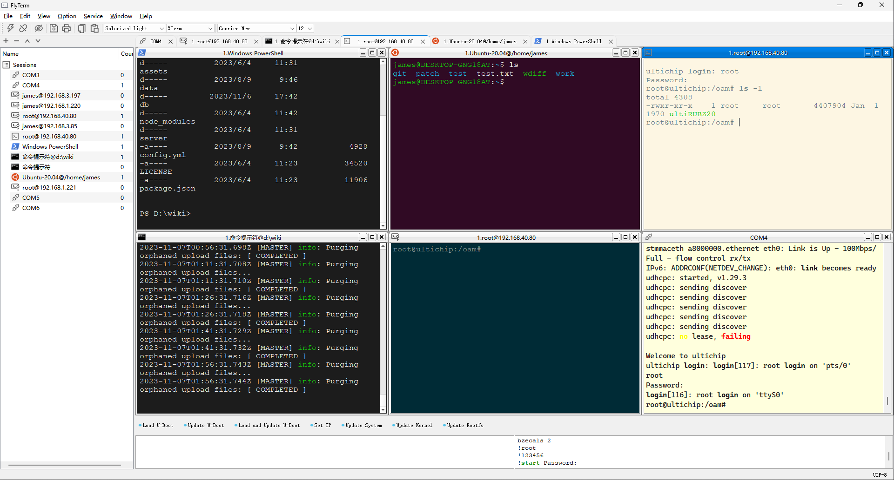

# FlyTerm
A terminal software that supports the SSH/Telnet/Serial/WSL/Cmd/Windows PowerShell protocol.

#### Description
Function List:
- Supports multiple windows and tab pages.
- Support SSH/SSH2 protocol 
  - Support uploading files to the current directory through the right-click menu 
  - Support downloading selected files locally through the right-click menu. 
- Supports Telnet protocol
- Supports serial protocol 
  - Support Kermit protocol for uploading files 
  - Support XModem protocol for uploading files 
  - Support YModem protocol for uploading files 
  - Supports displaying a list of serial ports 
- Support WSL (Linux subsystem under Windows) 
- Windows supported cmd 
- Supports Windows PowerShell 
- Support custom command button scripts. 
  - Support sleep function 
  - Support saving logs to files 
  - Support command sequence execution one by one 
  - Support custom button grouping 
- Support separate editing of commands 
- Support import and export command buttons 
- Support displaying command history 
- Support saving history window 
- Integrate TFTP Server functionality. 
- Support the software to automatically open the last closed window on the next startup 
- Interface supports both Chinese and English 
- Support custom terminal color palettes 
- Support customized foreground background debugging board 
- Support custom fonts 
- Supports multi style interfaces 
  - Windows Vista 
  - Windows 
  - Fusion

#### Installation

1.  Run setup/release/FlyTerm1.0-win-x64_202xxxxx.exe to setup.
2.  After installation, click on the FlyTerm shortcut on the desktop to run it。