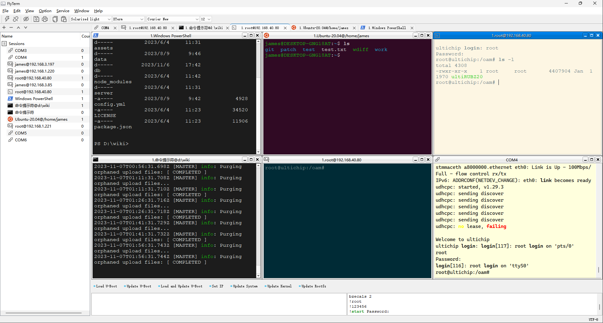

# FlyTerm
一款终端软件，支持SSH/Telnet/Serial/WSL/Cmd/Windows PowerShell协议。

#### 介绍
功能列表：
- 支持多窗口和Tab页。
- 支持SSH/SSH2协议
  - 支持通过右键菜单上传文件到当前目录
  - 支持通过右键菜单下载选中文件到本地。
- 支持的Telnet协议
- 支持串口协议
  - 支持Kermit协议上传文件
  - 支持XModem协议上传文件
  - 支持YModem协议上传文件
  - 支持显示串口端口列表
- 支持WSL（Windows下Linux子系统）
- 支持Windows的cmd
- 支持Windows PowerShell
- 支持自定义命令按钮脚本。
  - 支持sleep功能
  - 支持保存日志到文件
  - 支持命令顺序一个一个执行
- 支持自定义按钮分组 
- 支持命令单独编辑
- 支持导入导出命令按钮
- 支持显示命令历史
- 支持保存历史窗口
- 集成TFTP Server功能。
- 支持软件下次启动时自动打开上次关闭窗口
- 界面支持中英文
- 支持定制终端调色板
- 支持定制前景背景调试板
- 支持定制字体
- 支持多风格界面
  - WindowsVista
  - Windows
  - Fusion
#### 安装教程
1.  运行setup/release/FlyTerm1.0-win-x64_202xxxxx.exe安装
2.  安装完毕在桌面上点击FlyTerm快捷方式运行。